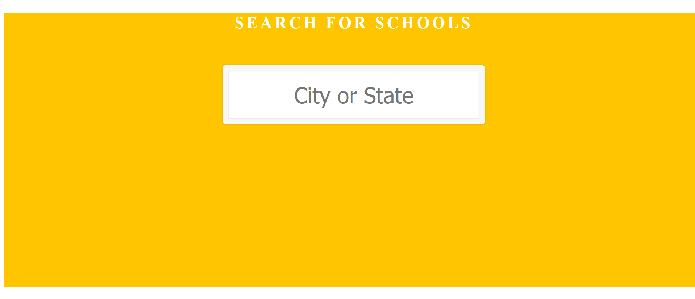

How to run? 
1. Go to Deployments folder
2. Copy /angular to tomcat/webapps/ 
3. run backend jar as java -jar autocomplete-0.0.1-SNAPSHOT.jar
4. Start tomcat 
5. go to http://localhost:8080/angular/
6. to fectch results using curl run: Curl -X GET http://localhost:3030/autocomplete?keyword=az
